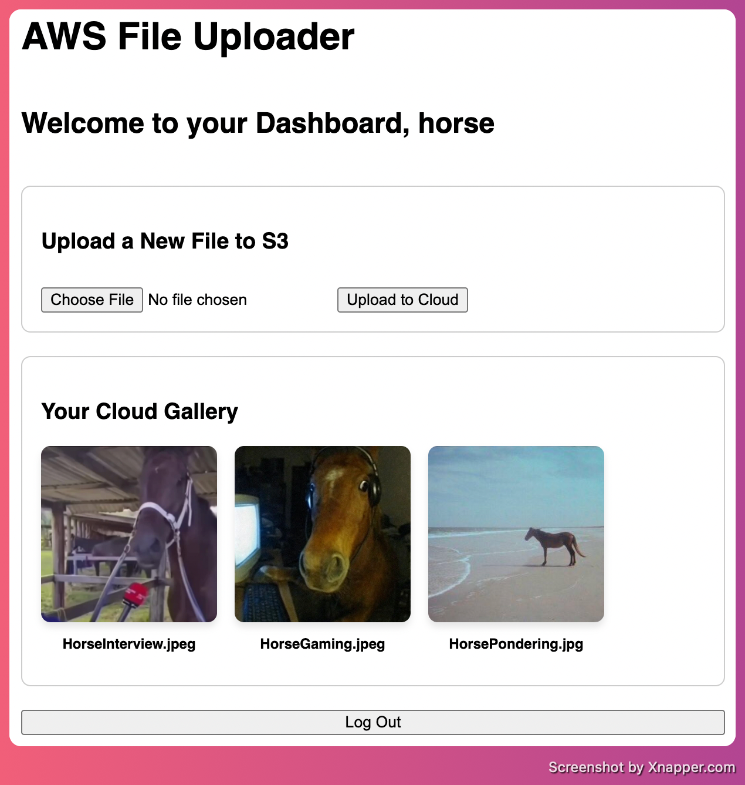
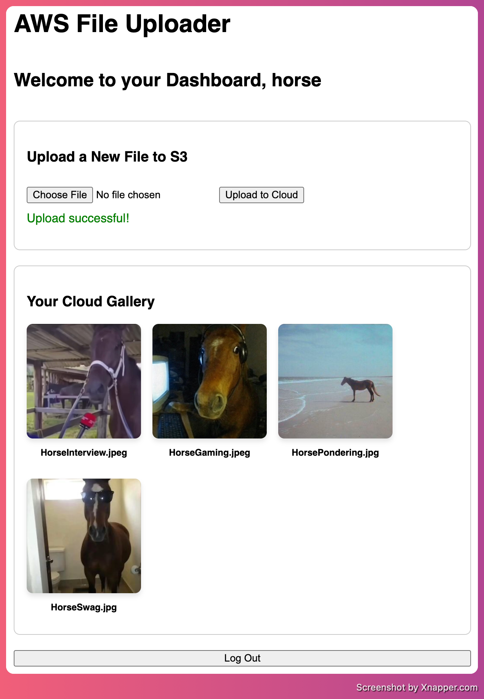
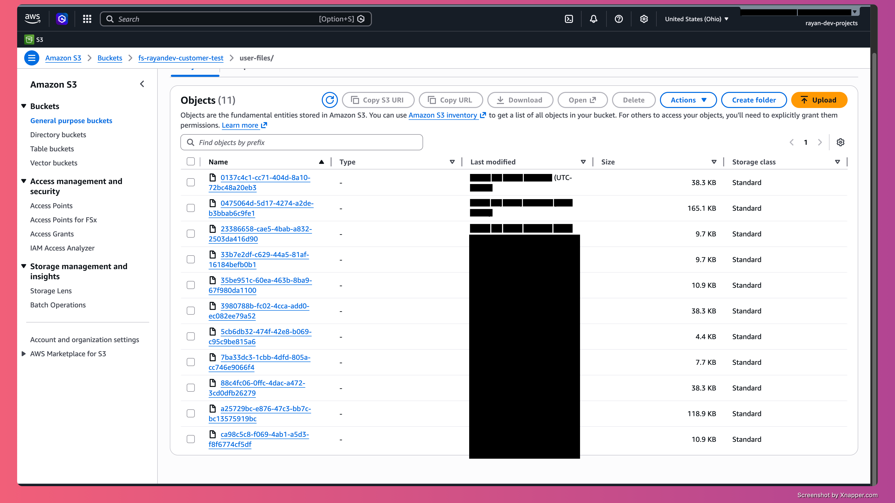

# AWS File Uploader

A full-stack file uploader built with Spring Boot + React that lets users:

- sign in with username/password (auto-register if user does not exist)
- upload image files to Amazon S3
- view their uploaded images

This project is currently optimized for local development and is planned for future EC2 deployment.

## Demo


### Screenshot Gallery

Authentication Screen:


User dashboard:




Sucessful Upload



Uploaded to Bucket:



## End result

This app demonstrates a practical cloud-integrated workflow:

- frontend user experience with React
- REST API design in Spring Boot
- relational persistence with JPA/PostgreSQL
- binary object storage using AWS S3

It is  simple and focused on core product behavior.

## Tech Stack

- Backend: Spring Boot 4, Spring Web MVC, Spring Data JPA
- Frontend: React (Vite), Axios
- Database: PostgreSQL
- Cloud Storage: Amazon S3 (AWS SDK v2)
- Build Tools: Maven, npm
- Runtime: Java 17, Node.js
- Containerized using docker

## Architecture Overview

1. User authenticates from React UI.
2. Backend checks user by username.
3. If user exists and password matches, user is returned.
4. If user does not exist, backend creates user and returns it.
5. User uploads image from UI.
6. Backend stores bytes in S3 under user-files/<uuid>.
7. Backend saves metadata (original filename + s3 key) in PostgreSQL.
8. UI renders gallery images by requesting backend file endpoint.

## Current Auth Model
this is a lightweight learning/portfolio auth flow

- No JWT/session-based security layer.
- Passwords are currently stored as plain text in the DB.
- Authentication route doubles as registration route.

For production hardening, see the roadmap section.

## API Endpoints

- POST /api/v1/users/auth
	- form-data: username, password
	- behavior: login existing user or auto-create new user

- POST /api/v1/users/{userId}/files
	- multipart/form-data: file
	- behavior: upload file to S3 and append metadata to user

- GET /api/v1/users/files/{s3Key}
	- behavior: fetch file bytes from S3 (currently served as image/jpeg)

## Local Development Setup

### Prerequisites

- Java 17+
- Node.js 18+
- npm
- PostgreSQL (local or Docker)
- AWS credentials configured in your environment with S3 access

### 1) Configure Backend

The backend config is in src/main/resources/application.yaml.

Default values include:

- DB URL: jdbc:postgresql://localhost:5433/file_uploader_db
- DB user: rayandev
- DB password: password
- S3 region: us-east-2
- S3 bucket: fs-rayandev-customer-test

Update these values to match your local/cloud setup.

### 2) Start PostgreSQL

Run your PostgreSQL instance on port 5433 (or update application.yaml accordingly).

### 3) Run Backend

From project root:

```bash
./mvnw spring-boot:run
```

Backend runs on:

- http://localhost:8080

### 4) Run Frontend

From frontend folder:

```bash
npm install
npm run dev
```

Frontend runs on (where project actually is):

- http://localhost:5173

## Project Structure

```text
.
├── src/main/java/com/rayandev/s3_uploader
│   ├── s3
│   │   ├── S3Config.java
│   │   ├── S3Buckets.java
│   │   └── S3Service.java
│   └── user
│       ├── User.java
│       ├── UserFile.java
│       ├── UserRepository.java
│       └── UserController.java
├── src/main/resources/application.yaml
├── frontend/src/App.jsx
└── docs/screenshots
```

## Testing

Current automated coverage is minimal (context load test)

## Deployment Roadmap

Planned tasks:

1. Deploy backend to EC2.
2. Serve frontend via S3 + CloudFront or Nginx.
3. Move DB to managed PostgreSQL (RDS).
4. Add secure auth (Spring Security + JWT + password hashing).

## License

This project is licensed under the terms in [LICENSE](LICENSE).
